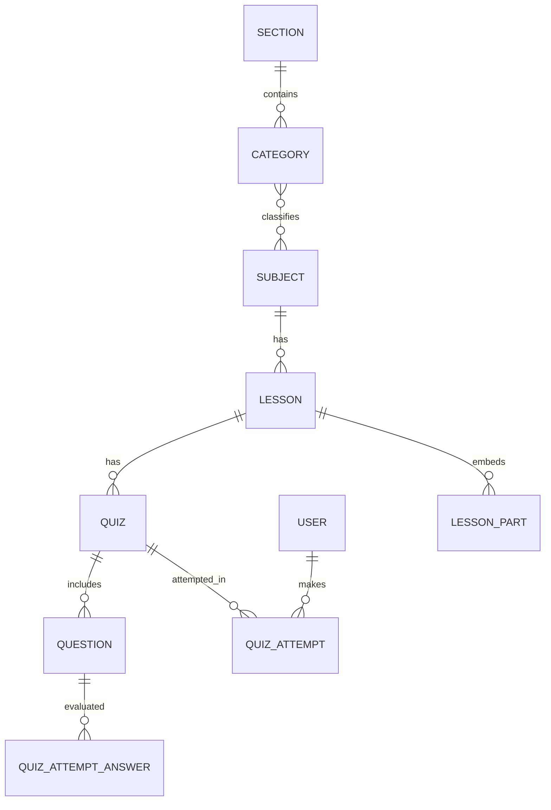

# Nursing Backend Developer Documentation

## 1) Project Overview

### Purpose
This backend is an Express + MongoDB API for a nursing-learning platform. It supports:
- Student/admin authentication and approval flow.
- Grade-based content organization (`grade` 1/2/3).
- Learning hierarchy: **Section → Category → Subject → Lesson → Quiz → Question**.
- Quiz submission and result history per user.

### Runtime and Entry Point
- Entry point: `server.js`.
- Base API prefixing:
  - `/api/auth`
  - `/api/users`
  - `/api/sections`
  - `/api/categories`
  - `/api/subjects`
  - `/api/*` for lessons/quizzes/questions/attempts.
- Health check: `GET /health`.

### Folder Structure and Key Files

| Folder/File | Responsibility |
|---|---|
| `server.js` | App bootstrap, middleware wiring, route mounting, DB connection, server start. |
| `config/env.js` | Environment variable loading and exports. |
| `config/database.js` | MongoDB connection setup through Mongoose. |
| `config/schools.js` | School code constants used by one auth flow. |
| `models/*.js` | Mongoose schemas/models for users, learning content, quizzes, attempts. |
| `controllers/*.js` | Request handlers (CRUD, auth, quiz grading/results). |
| `routes/*.js` | Endpoint-to-controller mapping + middleware/validators composition. |
| `middleware/authMiddleware.js` | JWT auth guard, injects `req.user`. |
| `middleware/adminMiddleware.js` | Admin-role guard for protected routes. |
| `middleware/errorMiddleware.js` | Centralized error responder. |
| `validators/*.js` | `express-validator` rule sets for auth/lesson/quiz payloads. |
| `utils/generateToken.js` | JWT generation helper used in one auth controller. |

### Main Libraries/Frameworks
- `express`
- `mongoose`
- `jsonwebtoken`
- `bcryptjs`
- `express-validator`
- `cors`
- `dotenv`

---

## 2) Database Models / Schemas

> Note: The codebase currently includes **two auth data model sets**:
> 1) Newer set: `User` (`models/User.js`) + `Admins` (`models/admins.model.js`) and routes `authRoutes.js`.
> 2) Legacy/parallel set: `users.model` (`models/users.model.js`) + `Admins` and routes `auth.routes.js`.
>
> Main mounted auth route in `server.js` is `authRoutes.js` (newer flow).

### 2.1 `Section` collection (`Section`)

| Field | Type | Required | Default | Relationships/Notes |
|---|---|---|---|---|
| `grade` | `String` enum `"1"|"2"|"3"` | Yes | — | **Grade field** (core grade partition key). |
| `name` | `String` | Yes | — | Unique with grade via compound unique index. |
| `nameAr` | `String` | No | `""` | Arabic label. |
| `description` | `String` | No | `""` |  |
| `descriptionAr` | `String` | No | `""` | Arabic description. |
| `order` | `Number` | No | `0` | Ordering inside grade. |
| `createdAt/updatedAt` | `Date` | Auto | Auto | Via timestamps. |

Indexes:
- Unique: `{ grade, name }`
- Sort-support: `{ grade, order }`

### 2.2 `Category` collection (`Category`)

| Field | Type | Required | Default | Relationships/Notes |
|---|---|---|---|---|
| `name` | `String` | Yes | — |  |
| `nameAr` | `String` | No | `""` |  |
| `sectionId` | `ObjectId` | Yes | — | **Many categories → one section** (`ref: Section`). |
| `description` | `String` | No | `""` |  |
| `descriptionAr` | `String` | No | `""` |  |
| `order` | `Number` | No | `0` |  |
| `createdAt/updatedAt` | `Date` | Auto | Auto |  |

Index: `{ sectionId, order }`

### 2.3 `Subject` collection (`Subject`)

| Field | Type | Required | Default | Relationships/Notes |
|---|---|---|---|---|
| `name` | `String` | Yes | — |  |
| `nameAr` | `String` | No | `""` |  |
| `categoryIds` | `ObjectId[]` | Yes (min 1 in API validator) | — | **Many subjects ↔ many categories** (array refs). |
| `description` | `String` | No | `""` |  |
| `descriptionAr` | `String` | No | `""` |  |
| `createdAt/updatedAt` | `Date` | Auto | Auto |  |

Index: `{ categoryIds: 1 }`

### 2.4 `Lesson` collection (`Lesson`)

| Field | Type | Required | Default | Relationships/Notes |
|---|---|---|---|---|
| `title` | `String` | Yes | — |  |
| `titleAr` | `String` | No | `""` |  |
| `subjectId` | `ObjectId` | Yes | — | **Many lessons → one subject** (`ref: Subject`). |
| `importance` | `String` | No | `""` |  |
| `importanceAr` | `String` | No | `""` |  |
| `parts` | `LessonPart[]` | No | `[]` | Embedded subdocuments for lesson content blocks. |
| `createdAt/updatedAt` | `Date` | Auto | Auto |  |

`LessonPart` embedded schema:
- `title` (required)
- `titleAr` (default `""`)
- `text` (default `""`)
- `textAr` (default `""`)
- `videos: string[]`
- `images: string[]`
- `files: string[]`

Index: `{ subjectId: 1 }`

### 2.5 `Quiz` collection (`Quiz`)

| Field | Type | Required | Default | Relationships/Notes |
|---|---|---|---|---|
| `lessonId` | `ObjectId` | Yes | — | **Many quizzes → one lesson** (`ref: Lesson`). |
| `title` | `String` | Yes | — |  |
| `timeLimit` | `Number` | No | `0` | Minutes; `0` can be interpreted as unlimited/no timer. |
| `createdAt/updatedAt` | `Date` | Auto | Auto |  |

Index: `{ lessonId: 1 }`

### 2.6 `Question` collection (`Question`)

| Field | Type | Required | Default | Relationships/Notes |
|---|---|---|---|---|
| `quizId` | `ObjectId` | Yes | — | **Many questions → one quiz** (`ref: Quiz`). |
| `question` | `String` | Yes | — |  |
| `questionAr` | `String` | No | `""` |  |
| `options` | `String[]` | Yes | — | At least 2 entries enforced in validator. |
| `optionsAr` | `String[]` | No | `[]` |  |
| `correctAnswer` | `String` | Yes | — | Must be one of `options` in controller checks. |
| `correctAnswerAr` | `String` | No | `""` |  |
| `explanation` | `String` | No | `""` |  |
| `explanationAr` | `String` | No | `""` |  |
| `createdAt/updatedAt` | `Date` | Auto | Auto |  |

Index: `{ quizId: 1 }`

### 2.7 `QuizAttempt` collection (`QuizAttempt`)

| Field | Type | Required | Default | Relationships/Notes |
|---|---|---|---|---|
| `userId` | `ObjectId` | Yes | — | **Many attempts → one user** (`ref: User`). |
| `quizId` | `ObjectId` | Yes | — | **Many attempts → one quiz** (`ref: Quiz`). |
| `answers` | `Answer[]` | No | `[]` | Embedded answer evaluations. |
| `score` | `Number` | Yes | — | Percentage (0..100 rounded). |
| `completedAt` | `Date` | No | `Date.now` | Explicit completion timestamp. |
| `createdAt/updatedAt` | `Date` | Auto | Auto |  |

`Answer` embedded schema:
- `questionId` (`ObjectId`, ref `Question`, required)
- `selectedAnswer` (`String`, required)
- `isCorrect` (`Boolean`, required)

Index: `{ userId, quizId, completedAt: -1 }`

### 2.8 `User` collection(s)

#### A) `models/User.js` → model name `Users`

| Field | Type | Required | Default | Relationships/Notes |
|---|---|---|---|---|
| `name` | `String` | Yes | — |  |
| `grade` | `String` enum `1/2/3/1st/2nd/3rd` | Yes | — | **Grade field**. |
| `governorate` | `String` | Yes | — |  |
| `classNumber` | `String` | Yes | — |  |
| `schoolName` | `String` | Yes | — |  |
| `role` | `String` enum `student` | No | `student` | For authz; admin data is separate model. |
| `isApproved` | `Boolean` | No | `false` | Approval gate for students. |
| `createdAt` | `Date` | No | `Date.now` | Also timestamps enabled (duplicative). |
| `updatedAt` | `Date` | Auto | Auto |  |

#### B) `models/users.model.js` → model name `User` (legacy/parallel)

| Field | Type | Required | Default | Relationships/Notes |
|---|---|---|---|---|
| `name` | `String` | Yes | — |  |
| `school` | `String` | Yes | — |  |
| `grade` | `String` enum `1/2/3` | Yes | — | **Grade field**. |
| `class` | `String` | Yes | — |  |
| `governorate` | `String` | Yes | — |  |
| `approvalStatus` | `String` enum `pending/approved/rejected` | No | `pending` | Legacy approval status style. |
| `role` | `String` enum `student` | No | `student` |  |

### 2.9 `Admins` collection (`Admins`)

| Field | Type | Required | Default | Relationships/Notes |
|---|---|---|---|---|
| `role` | `String` enum `admin` | No | `admin` | Used by admin middleware checks. |
| `name` | `String` | Yes | — |  |
| `phoneNumber` | `String` | Yes | — | Egyptian phone regex validation. |
| `isApproved` | `Boolean` | No | `true` | Admins generally pre-approved. |

### 2.10 Enums, Constants, and Lookup Tables

- Grades:
  - `Section.grade`: strict enum `"1"|"2"|"3"`.
  - `users.model.grade`: enum `"1"|"2"|"3"`.
  - `User.grade`: enum includes `"1","2","3","1st","2nd","3rd"`.
- Roles:
  - `student` (users), `admin` (admins).
- Approval statuses:
  - Legacy: `pending`, `approved`, `rejected` in `users.model`.
  - Newer: boolean `isApproved` in `User`.
- School lookup constants in `config/schools.js` used by `auth.controllers.js` to map school key → numeric code (`SCHOOL_CODES`).

### Grade and Tools/Common Resources Fields (Explicit Highlight)
- **Grade-related fields**:
  - `Section.grade` (primary content partition).
  - `User.grade` and `users.model.grade`.
  - Input validation on section creation/update enforces grade `1/2/3`.
- **Common resources/tools fields**:
  - Not modeled as a dedicated top-level collection.
  - Lesson content resources are embedded in `Lesson.parts[*]` as arrays:
    - `videos[]`, `images[]`, `files[]`.

---

## 3) API Endpoints

> Mounted base paths come from `server.js`. Two auth route files exist; only `routes/authRoutes.js` is mounted.

### 3.1 Health

| Method | Path | Handler | Auth | Request | Response |
|---|---|---|---|---|---|
| GET | `/health` | inline in `server.js` | No | none | `{ status: "ok" }` |

### 3.2 Authentication (`/api/auth`)

| Method | Path | Controller.fn | Auth | Request | Response |
|---|---|---|---|---|---|
| POST | `/api/auth/signup` | `authController.signup` | No | Body: `name, grade, governorate, classNumber, schoolName` | `201` with message + user summary (`id,name,role,isApproved`). |
| POST | `/api/auth/login` | `authController.login` | No | Body: `id, name` | `200` with JWT token + user summary; sets `token` cookie. |

Special behavior:
- Signup rejects duplicate by `name + classNumber + schoolName`.
- Student login denied if `isApproved === false`.
- Admin lookup fallback in `Admins` model.

### 3.3 Users/Admin moderation (`/api/users`)

| Method | Path | Controller.fn | AuthZ | Request | Response |
|---|---|---|---|---|---|
| GET | `/api/users?status=approved|pending` | `userController.getUsers` | `auth + admin` | Query optional `status` | Student list sorted by newest. |
| PATCH | `/api/users/approve/:id` | `userController.approveUser` | `auth + admin` | Path `id` | Message + updated user. |
| DELETE | `/api/users/:id` | `userController.deleteUser` | `auth + admin` | Path `id` | Delete confirmation message. |

### 3.4 Sections (`/api/sections`)

| Method | Path | Controller.fn | AuthZ | Request | Response |
|---|---|---|---|---|---|
| GET | `/api/sections` | `sectionController.getSections` | Public | none | Section array sorted by `grade, order, name`. |
| POST | `/api/sections` | `sectionController.createSection` | `auth + admin` | Body: `name`, `grade` (`1/2/3`), optional `nameAr, description, descriptionAr, order` | Created section. |
| PATCH | `/api/sections/:id` | `sectionController.updateSection` | `auth + admin` | Path `id`; partial body; `grade` validated if present | Updated section or 404. |
| DELETE | `/api/sections/:id` | `sectionController.deleteSection` | `auth + admin` | Path `id` | Delete confirmation. |

Grade behavior:
- Grade value validated at route layer and persisted in `Section.grade`; this drives upper-level organization.

### 3.5 Categories (`/api/categories`)

| Method | Path | Controller.fn | AuthZ | Request | Response |
|---|---|---|---|---|---|
| GET | `/api/categories` | `categoryController.getCategories` | Public | none | All categories sorted by `order,name`. |
| GET | `/api/categories/:sectionId` | `categoryController.getCategories` | Public | Path `sectionId` | Categories filtered by section. |
| POST | `/api/categories` | `categoryController.createCategory` | `auth + admin` | Body includes `name`, `sectionId`, optional localized/description fields | Created category; validates section existence. |
| PATCH | `/api/categories/:id` | `categoryController.updateCategory` | `auth + admin` | Path `id`, partial body | Updated category or 404. |
| DELETE | `/api/categories/:id` | `categoryController.deleteCategory` | `auth + admin` | Path `id` | Delete confirmation. |

### 3.6 Subjects (`/api/subjects`)

| Method | Path | Controller.fn | AuthZ | Request | Response |
|---|---|---|---|---|---|
| GET | `/api/subjects` | `subjectController.getSubjects` | Public | none | All subjects sorted by name. |
| GET | `/api/subjects/:categoryId` | `subjectController.getSubjects` | Public | Path `categoryId` | Subjects where `categoryIds` contains `categoryId`. |
| POST | `/api/subjects` | `subjectController.createSubject` | `auth + admin` | Body: `name`, `categoryIds[]` (min 1), optional localized fields | Created subject; validates all category IDs exist. |
| PATCH | `/api/subjects/:id` | `subjectController.updateSubject` | `auth + admin` | Path `id`, partial body | Updated subject or 404. |
| DELETE | `/api/subjects/:id` | `subjectController.deleteSubject` | `auth + admin` | Path `id` | Delete confirmation. |

### 3.7 Lessons (`/api`)

| Method | Path | Controller.fn | AuthZ | Request | Response |
|---|---|---|---|---|---|
| GET | `/api/lessons/:subjectId` | `lessonController.getLessons` | Public | Path `subjectId` | Lessons for subject sorted newest first. |
| GET | `/api/lesson/:lessonId` | `lessonController.getLessonById` | Public | Path `lessonId` | Single lesson with embedded parts. |
| POST | `/api/lesson` | `lessonController.createLesson` | `auth + admin` | Body: `title`, `subjectId`, optional localized + `parts` | Created lesson; validates subject exists. |
| PATCH | `/api/lesson/:lessonId` | `lessonController.updateLesson` | `auth + admin` | Path `lessonId`; partial body | Updated lesson. |
| DELETE | `/api/lesson/:lessonId` | `lessonController.deleteLesson` | `auth + admin` | Path `lessonId` | Delete confirmation. |
| POST | `/api/lesson/:lessonId/part` | `lessonController.addPart` | `auth + admin` | Path `lessonId`; body part fields (`title`, optional `text/videos/images/files`) | Updated lesson with new part. |
| PATCH | `/api/lesson/:lessonId/part/:partId` | `lessonController.updatePart` | `auth + admin` | Path IDs + partial part body | Lesson with updated part. |
| DELETE | `/api/lesson/:lessonId/part/:partId` | `lessonController.deletePart` | `auth + admin` | Path IDs | Lesson after part removal. |

Tools/resources behavior:
- `videos/images/files` arrays under lesson parts represent reusable learning resources.

### 3.8 Quizzes and Questions (`/api`)

#### Quizzes

| Method | Path | Controller.fn | AuthZ | Request | Response |
|---|---|---|---|---|---|
| POST | `/api/quiz` | `quizController.createQuiz` | `auth + admin` | Body: `lessonId`, `title`, optional `timeLimit` | Created quiz (lesson existence validated). |
| GET | `/api/quiz/:lessonId` | `quizController.getQuizByLesson` | `auth` | Path `lessonId` | Quiz object + embedded `questions[]`. |

#### Questions

| Method | Path | Controller.fn | AuthZ | Request | Response |
|---|---|---|---|---|---|
| POST | `/api/question` | `questionController.createQuestion` | `auth + admin` | Body: `quizId, question, options[], correctAnswer` (+ optional localized/explanation) | Created question; validates quiz exists and answer in options. |
| PATCH | `/api/question/:id` | `questionController.updateQuestion` | `auth + admin` | Path `id`; partial body | Updated question; checks options/correctAnswer consistency if both sent. |
| DELETE | `/api/question/:id` | `questionController.deleteQuestion` | `auth + admin` | Path `id` | Delete confirmation. |

### 3.9 Quiz Attempts/Results (`/api`)

| Method | Path | Controller.fn | AuthZ | Request | Response |
|---|---|---|---|---|---|
| POST | `/api/quiz/submit` | `quizAttemptController.submitQuiz` | `auth` | Body: `quizId`, `answers[]` (`questionId`, `selectedAnswer`) | Creates attempt with evaluated answers + computed score (%). |
| GET | `/api/quiz/results/:userId` | `quizAttemptController.getResults` | `auth` + owner/admin check | Path `userId` | Attempts list with populated quiz title + lessonId. |

Special behavior:
- Submit flow computes `isCorrect` per answer and rounded percentage score.
- Results are visible only to the user themselves or an admin.

---

## 4) Relationships & ER Model

### Mermaid ER Diagram

### Relationship Summary Table

| From | To | Cardinality | Implementation |
|---|---|---|---|
| Section | Category | 1:N | `Category.sectionId -> Section._id` |
| Category | Subject | N:M | `Subject.categoryIds[]` contains category IDs |
| Subject | Lesson | 1:N | `Lesson.subjectId -> Subject._id` |
| Lesson | Quiz | 1:N (practically often 1:1 by query style) | `Quiz.lessonId -> Lesson._id` |
| Quiz | Question | 1:N | `Question.quizId -> Quiz._id` |
| User | QuizAttempt | 1:N | `QuizAttempt.userId -> User._id` |
| Quiz | QuizAttempt | 1:N | `QuizAttempt.quizId -> Quiz._id` |
| QuizAttempt | Answers | 1:N embedded | `QuizAttempt.answers[]` subdocs |
| Lesson | LessonPart | 1:N embedded | `Lesson.parts[]` subdocs |

---

## 5) Authentication & Authorization

### Auth mechanism
- JWT-based auth using `jsonwebtoken`.
- Auth middleware expects `Authorization: Bearer <token>` header.
- After verify, user lookup is attempted in student collection first, then admins.
- On success middleware adds `req.user = { id, role }`.

### Role-based access
- `adminMiddleware` permits only `req.user.role === "admin"`.
- Combined protection pattern:
  - `auth` only: authenticated student/admin allowed.
  - `auth + admin`: only admins allowed.

### Endpoint protection summary

- Public:
  - `GET /health`
  - `POST /api/auth/signup`
  - `POST /api/auth/login`
  - `GET /api/sections`
  - `GET /api/categories`, `GET /api/categories/:sectionId`
  - `GET /api/subjects`, `GET /api/subjects/:categoryId`
  - `GET /api/lessons/:subjectId`, `GET /api/lesson/:lessonId`
- Authenticated (`auth`):
  - `GET /api/quiz/:lessonId`
  - `POST /api/quiz/submit`
  - `GET /api/quiz/results/:userId` (plus owner/admin restriction)
- Admin-only (`auth + admin`):
  - All write operations on sections/categories/subjects/lessons/parts/quizzes/questions
  - All `/api/users` moderation endpoints

---

## 6) Business Logic Notes

### Middleware and global utilities
- `authMiddleware`:
  - extracts and verifies JWT.
  - handles missing/expired token cases.
- `adminMiddleware`:
  - enforces admin-only actions.
- `errorMiddleware`:
  - catches forwarded errors and standardizes JSON error response.
- `generateToken` utility:
  - signs JWT with configured secret and expiry.

### Grade-based logic (1, 2, 3)
- Grade is a first-class field in:
  - `Section.grade` (strict 1/2/3) used to organize curriculum branches.
  - User models (`User.grade`, `users.model.grade`).
- Route-level grade validation exists for section create/update.
- Although there is no direct `grade` in category/subject/lesson tables, grade-based filtering is achieved indirectly by traversing relationships from `Section` downward:
  - Grade → Sections → Categories → Subjects → Lessons → Quizzes.

### Tools and common resources logic
- There is no dedicated `tools` or `commonResources` collection.
- Resource storage is implemented inside lesson parts:
  - `Lesson.parts[].videos[]`
  - `Lesson.parts[].images[]`
  - `Lesson.parts[].files[]`
- Access is through lesson endpoints (`/api/lesson...`, `/api/lessons...`), and implicitly tied to grade via the section/category/subject chain.

### Validation and data integrity highlights
- `express-validator` is consistently used for auth, lesson, quiz, question, and quiz-attempt payloads.
- Controllers perform relational integrity checks before create:
  - Category requires existing section.
  - Subject requires all category IDs exist.
  - Lesson requires existing subject.
  - Quiz requires existing lesson.
  - Question requires existing quiz and correct answer in options.

### Architectural note (important)
- The project currently has duplicated auth route/controller/model sets (`authRoutes.js` + `authController.js` vs `auth.routes.js` + `auth.controllers.js`).
- Only one (`authRoutes.js`) is mounted by default, but both remain in code and may confuse maintenance unless consolidated.

---

## 7) Quick Reference: Route Index

| Route Group | Base |
|---|---|
| Health | `/health` |
| Auth | `/api/auth` |
| Users | `/api/users` |
| Sections | `/api/sections` |
| Categories | `/api/categories` |
| Subjects | `/api/subjects` |
| Lessons | `/api/lesson`, `/api/lessons` |
| Quizzes | `/api/quiz` |
| Questions | `/api/question` |
| Attempts/Results | `/api/quiz/submit`, `/api/quiz/results/:userId` |

